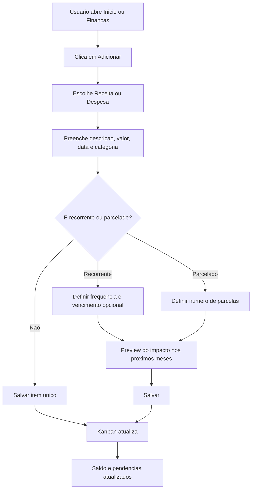
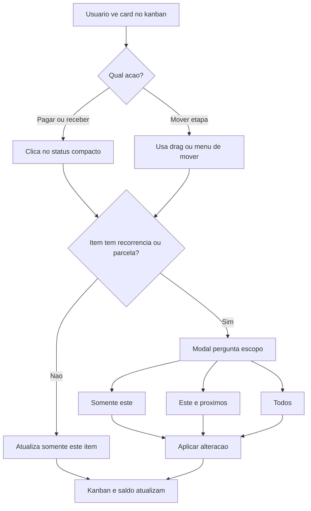
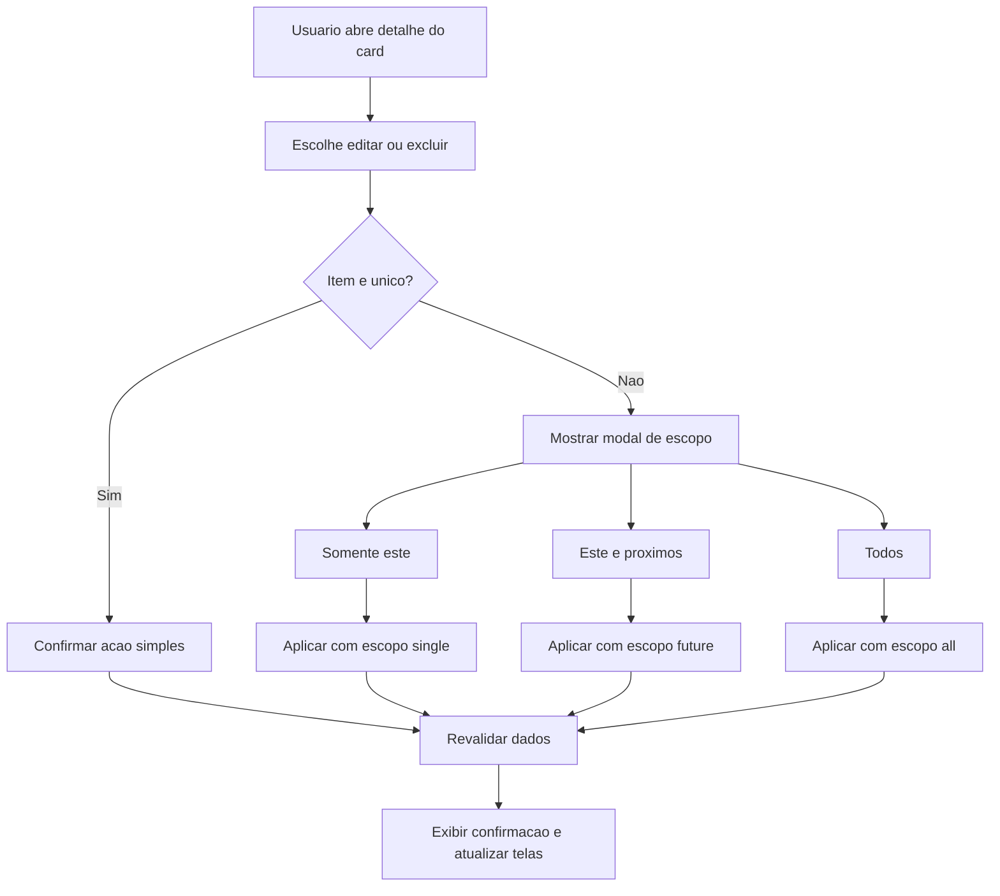
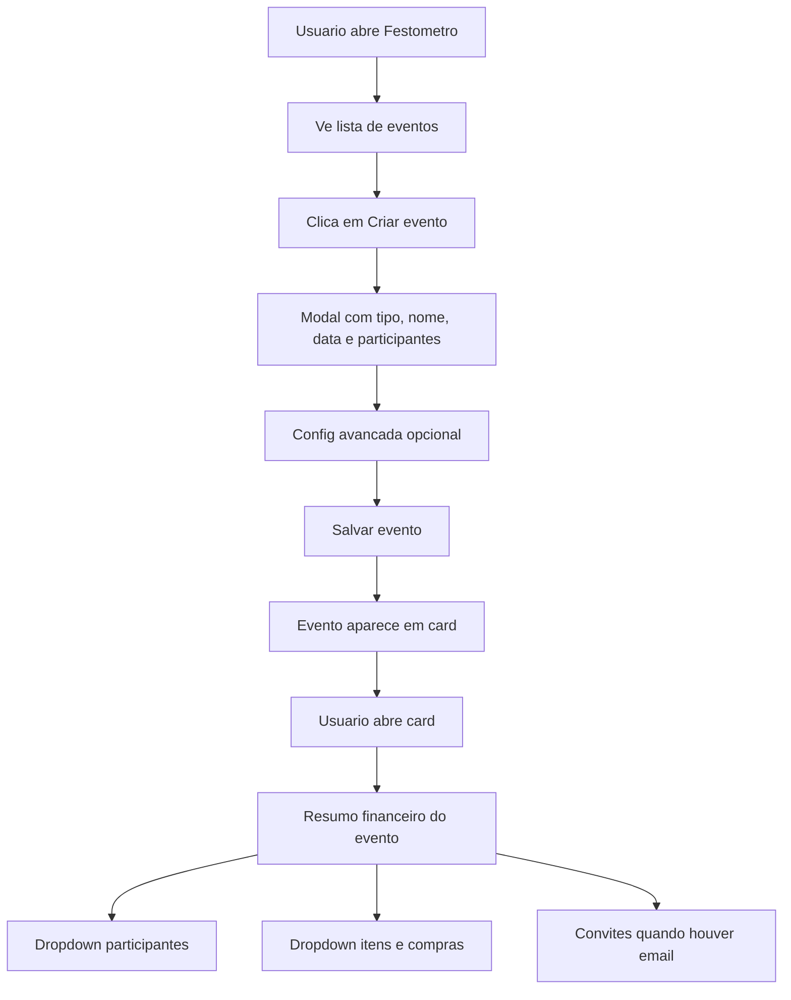

---
stepsCompleted:
  - 1
  - 2
  - 3
  - 4
  - 5
  - 6
  - 7
  - 8
  - 9
  - 10
  - 11
  - 12
  - 13
  - 14
lastStep: 14
inputDocuments:
  - _bmad-output/planning-artifacts/prd.md
  - _bmad-output/project-context.md
  - docs/bmad/current-state.md
  - docs/bmad/README.md
  - docs/bmad/roadmap.md
  - docs/bmad/work-log.md
  - docs/qa/core-finance-reliability.md
  - _bmad-output/implementation-artifacts/spec-core-finance-reliability-qa.md
  - _bmad-output/implementation-artifacts/spec-festometro-event-manager-direction.md
  - _bmad-output/implementation-artifacts/spec-fix-encoding-texts.md
---

# UX Design Specification Deu Bom Financas sem erro

**Author:** Alisson
**Date:** 2026-04-28

---

<!-- UX design content will be appended sequentially through collaborative workflow steps -->

## Executive Summary

### Project Vision

O Deu Bom - Financas sem erro e um web app/PWA de financas pessoais criado para transformar ansiedade financeira em proxima acao clara. A experiencia deve ser simples no primeiro olhar, confiavel nos detalhes e gentil nos momentos de tensao.

O produto nao deve parecer uma planilha nem uma bronca. Deve funcionar como um lugar calmo onde a pessoa entende o que esta acontecendo com o dinheiro, o que merece atencao agora e qual acao deve tomar em seguida.

A UX do MVP deve priorizar:

- confianca nos numeros;
- distincao forte entre telas;
- operacao simples em mobile;
- formularios progressivos;
- microcopy clara e acolhedora;
- complexidade revelada em camadas.

Recursos expressivos como Festometro e Workspace so devem ganhar peso quando reforcarem clareza, controle e decisao pratica.

### Target Users

O publico principal sao pessoas entre 20 e 40 anos que querem organizar dinheiro sem virar especialistas. Elas podem estar ansiosas, atrasadas, com vergonha de recomecar ou cansadas de planilhas e apps cheios de informacao.

Esses usuarios precisam:

- saber por onde comecar;
- cadastrar receitas e despesas sem medo;
- entender recorrencias e parcelas;
- confiar que os calculos estao corretos;
- enxergar o impacto do mes atual e dos proximos;
- agir no mobile sem depender de interacoes delicadas.

Familias, equipes e pequenos negocios tambem fazem parte da evolucao por meio de workspaces, mas a UX inicial deve tratar esse uso como extensao do nucleo, nao como centro do MVP.

### Key Design Challenges

1. **Reduzir complexidade sem esconder controle importante.**  
   O app precisa permitir recorrencias, parcelas, workspace, metas, eventos e relatorios sem parecer pesado. A UX deve revelar complexidade em camadas.

2. **Construir confianca nos numeros.**  
   Todo numero precisa parecer rastreavel. Saldos, previsoes, recorrencias, parcelas e totais devem ter contexto simples: origem, periodo, status e impacto.

3. **Separar papeis de tela sem fragmentar a experiencia.**  
   Inicio deve ser guia diario. Financas deve ser centro operacional. Metas deve mostrar direcao. Relatorios deve explicar comportamento historico. Festometro deve ajudar a planejar eventos sem virar dashboard financeiro paralelo.

4. **Tornar o mobile realmente confortavel.**  
   Kanban, drag, filtros e modais longos precisam alternativas claras para toque, scroll e uso com uma mao. No mobile, o usuario nao deve depender de arrastar cards para concluir tarefas essenciais.

5. **Proteger a sensacao de estabilidade.**  
   Textos com encoding quebrado, termos ambiguos, excesso de instrucao e elementos que mudam demais ao hover passam sensacao de erro. Em um app financeiro, isso fere confianca.

6. **Manter a fonte unica da verdade financeira.**  
   Nenhum componente financeiro deve apresentar numeros calculados localmente sem usar derivadores oficiais do estado financeiro. A experiencia visual precisa proteger a consistencia tecnica.

### Design Opportunities

1. **Inicio como guia financeiro diario.**  
   A tela inicial deve responder rapidamente: estou bem hoje, o que merece atencao e quanto posso usar sem me enrolar.

2. **Financas como central operacional confiavel.**  
   A tela de financas deve permitir registrar, revisar, mover, editar e excluir lancamentos com seguranca, incluindo escopo claro para recorrencias e parcelas.

3. **Relatorios como explicacao, nao concorrencia.**  
   Relatorios devem responder como o dinheiro se comportou, quais padroes surgiram e o que mudou ao longo do tempo. Nao devem disputar papel com Inicio.

4. **Festometro como diferencial memoravel e pratico.**  
   O Festometro deve ajudar a planejar evento, estimar compras, dividir custos e entender se aquilo compromete o mes. Ele pode ser divertido, mas precisa responder uma pergunta financeira concreta.

5. **Microcopy como ferramenta de confianca.**  
   Textos pequenos, diretos e acionaveis devem explicar recorrencia, parcela, workspace, importacao, exclusao e dados pendentes sem transformar a interface em manual.

6. **UX por camadas.**  
   - Camada 1: visao rapida, linguagem simples e proximo passo.
   - Camada 2: detalhes editaveis, filtros, status e historico.
   - Camada 3: regras avancadas, recorrencia, parcelamento e impacto futuro.

### UX Acceptance Criteria & Test Hooks

- `AC-UX-01`: textos visiveis nao exibem mojibake nas rotas principais: Inicio, Financas, Metas, Relatorios, Festometro e Configuracoes.
- `AC-UX-02`: o usuario entende em ate 5 segundos se o mes esta positivo, negativo ou em atencao.
- `AC-UX-03`: cada tela principal tem uma funcao distinta e nomeavel.
- `AC-UX-04`: nenhum fluxo financeiro essencial exige preencher campos avancados para salvar.
- `AC-UX-05`: transacoes recorrentes e parceladas deixam claro o impacto no mes atual e nos proximos.
- `AC-UX-06`: no mobile, o usuario consegue registrar, editar, revisar e mover transacoes sem depender de arrastar cards.
- `AC-UX-07`: numeros financeiros mostram origem ou contexto: periodo, status, escopo, filtro ativo ou estado de sincronizacao.
- `AC-UX-08`: todos os fluxos criticos tem estados de carregando, vazio, erro, sucesso, sem permissao e sincronizando quando aplicavel.
- `AC-UX-09`: Festometro tem papel claro de planejamento de evento e orcamento, nao de dashboard financeiro paralelo.
- `AC-UX-10`: telas principais funcionam em 360px, 768px e desktop sem overflow horizontal incoerente.

### Implementation Guardrails

- `financeStore` continua sendo a fonte unica para dados financeiros e mutacoes criticas.
- Acoes financeiras seguem o contrato: executar mutacao, revalidar dados, refletir estado persistido e explicar escopo quando houver risco de impacto amplo.
- Recorrencias e parcelas preservam `groupId`, `parentTransactionId` e escopos `single`, `future` e `all`.
- Graficos e resumos devem consumir seletores ou derivadores compartilhados, evitando logica financeira duplicada por tela.
- Formularios longos devem usar progressao, recolhimento ou etapas, principalmente no mobile.
- Validacao minima por frente: `npm run lint`, `npm run build` e checklist responsivo/funcional para fluxos tocados.

## Core User Experience

### Defining Experience

The core experience of Deu Bom is the financial control loop: the user records an income or expense, sees the impact in the current month, understands what is paid or pending, and knows the next action without needing to interpret a dense dashboard.

The defining action for the MVP is: **register, review, or settle a financial transaction and immediately understand its impact on the monthly balance, pending items, and next step.**

Metas, Festometro, workspace, reports, invites, and recovery flows are important satellite experiences. They should support the main financial loop instead of competing with it on the first screen or in the primary navigation flow.

### Platform Strategy

Deu Bom should behave as a mobile-first PWA that also feels precise on desktop. Mobile interactions need touch-friendly controls, compact filters, bottom sheets for creation and editing, and alternatives to drag actions. Desktop can use wider kanban layouts, sidebar navigation, and richer table/detail states, but the same conceptual model must remain intact.

Key platform decisions:

- Mobile uses direct actions, bottom sheets, compact selectors, and visible fallback buttons for moving cards.
- Desktop may support drag and drop, expanded detail panels, and denser comparisons.
- Modals are reserved for confirmation, destructive changes, recurrence/installment scope, and important impact decisions.
- Supabase sync states should be visible but discreet: saving, saved, failed, and offline/retry states must not feel like technical noise.
- Navigation should make the role of each screen obvious: Inicio for current month orientation, Financas for transaction operation, Dashboard for analysis, Metas for goals, Festometro for event planning, Config for account and workspace preferences.

### Effortless Interactions

The MVP interactions should feel light, predictable, and recoverable:

- Add income or expense with only the essential fields first: type, description, amount, date/month, category, and status.
- Mark an item as paid or received directly from the card without opening full edit mode.
- Show the monthly balance with context, not as an isolated number.
- Separate pending from completed items visually and logically.
- Change month without losing orientation or making recurring data appear to vanish.
- Edit or delete recurring/installment items only after the user chooses the scope: only this item, this and next, or all.
- Convert a unique transaction into recurring or installment through an explicit selector, with clear preview of how many future records will be affected.
- Move kanban cards by drag on desktop and by lightweight action controls on mobile.
- Keep advanced fields optional and collapsed unless the user asks for more control.

### Critical Success Moments

The critical UX moments for the MVP are:

- The first transaction is created and the user sees where it went.
- The first monthly balance is understood in less than a few seconds.
- The first pending item is resolved without opening multiple screens.
- The first recurring salary or installment debt appears in the correct future months.
- The first broad edit or deletion is confirmed with the correct scope and no surprise data loss.
- The first error state explains what happened and how to retry.

Satellite moments for the roadmap:

- The first goal makes the user feel they have a path for leftover money.
- The first Festometro event shows whether the event fits the budget and what each person should contribute.
- The first workspace invite or password recovery flow confirms trust in account access.

### Experience Principles

1. Next action before full dashboard.
2. Every number needs context.
3. Complexity appears in layers, never all at once.
4. Mobile must not depend on dragging.
5. Broad financial impact always needs confirmation.
6. Language should be calm, adult, and direct.
7. Each screen answers one main question.
8. Satellite experiences support the finance loop instead of competing with it.

## Desired Emotional Response

### Primary Emotional Goals

O Deu Bom deve fazer o usuario sentir calma, controle e clareza. A pessoa precisa sair da sensacao de "nao sei o que esta acontecendo com meu dinheiro" para "eu entendi meu mes e sei o proximo passo".

A emocao principal nao e empolgacao exagerada. E alivio com confianca.

O produto deve transmitir:

- controle sem rigidez;
- simplicidade sem parecer raso;
- seguranca nos calculos;
- leveza visual;
- sensacao de progresso real;
- acolhimento para quem esta comecando ou reorganizando a vida financeira.

### Emotional Journey Mapping

Quando o usuario descobre o produto, deve sentir que encontrou uma ferramenta acessivel, direta e possivel de usar mesmo comecando do zero.

Durante o uso principal, deve sentir orientacao. Cada tela precisa reduzir duvida, nao criar novas perguntas.

Apos concluir uma tarefa, como cadastrar uma despesa, marcar algo como pago ou revisar o saldo, deve sentir fechamento: "isso foi salvo, eu entendi o impacto e posso seguir".

Quando algo da errado, a experiencia deve preservar confianca. O erro precisa explicar o que aconteceu, o que foi mantido e qual acao resolve.

Ao retornar ao app, o usuario deve sentir continuidade. Nada deve parecer perdido, confuso ou imprevisivel.

### Micro-Emotions

As micro-emocoes mais importantes sao:

- confianca em vez de desconfianca;
- clareza em vez de confusao;
- alivio em vez de ansiedade;
- progresso em vez de culpa;
- seguranca em vez de medo de apagar dados;
- foco em vez de excesso de informacao;
- dominio gradual em vez de dependencia do app.

### Design Implications

- Calma -> telas com poucos focos principais, bom espacamento e cores moderadas.
- Controle -> acoes claras de editar, excluir, pagar, receber, mover e desfazer quando possivel.
- Confianca -> numeros sempre com contexto, periodo, status e origem.
- Alivio -> mensagens curtas que confirmam salvamento e mostram impacto.
- Seguranca -> confirmacoes fortes para recorrencias, parcelas e exclusoes amplas.
- Progresso -> pequenos estados de conclusao, pendencia resolvida e mes organizado.
- Clareza -> cada tela com uma pergunta central e sem textos genericos como "visao geral" sem funcao pratica.

### Emotional Design Principles

1. O usuario nunca deve sentir que precisa entender financas para usar o app.
2. Toda acao importante deve terminar com confirmacao clara.
3. Toda tela deve diminuir ansiedade.
4. Todo numero deve parecer confiavel e rastreavel.
5. O app deve orientar sem infantilizar.
6. A interface deve ser discreta, elegante e funcional.
7. Momentos de erro devem proteger a confianca do usuario.
8. O usuario deve sentir que esta avancando, mesmo em pequenos passos.

## UX Pattern Analysis & Inspiration

### Inspiring Products Analysis

**Nubank**
Resolve operacoes financeiras complexas com linguagem simples, hierarquia clara e poucos focos por tela. A inspiracao principal e a confianca: o usuario entende saldo, acoes principais e estado da conta sem precisar interpretar uma planilha.

**Notion**
Organiza informacao em camadas, permitindo comecar simples e aprofundar quando necessario. A inspiracao util para o Deu Bom e a progressao: visao limpa primeiro, detalhes depois.

**Trello**
Transforma fluxo de trabalho em movimento visual simples. Para o Deu Bom, o kanban financeiro pode aproveitar essa clareza, mas precisa de alternativas mobile para nao depender apenas de arrastar cards.

**Mobills / Organizze**
Mostram padroes conhecidos de financas pessoais: categorias, recorrencias, parcelas, relatorios e metas. A principal licao e manter esses recursos uteis sem deixar a interface pesada demais.

### Transferable UX Patterns

- Navegacao por papel de tela: cada area responde uma pergunta principal.
- Cartoes financeiros com acao direta: pagar, receber, editar ou ver detalhe.
- Detalhe progressivo: resumo primeiro, informacoes avancadas sob demanda.
- Kanban operacional para pendencias e concluidos.
- Confirmacao de impacto para recorrencias, parcelas e exclusoes.
- Indicadores discretos de sincronizacao e salvamento.
- Filtros compactos, especialmente no mobile.
- Modais e bottom sheets focados em uma tarefa por vez.

### Anti-Patterns to Avoid

- Dashboard inicial com excesso de metricas.
- Cards grandes demais no mobile.
- Filtros ocupando mais espaco que o conteudo.
- Textos genericos como "visao geral" sem explicar acao ou valor.
- Recorrencias e parcelas escondidas ou imprevisiveis.
- Depender de drag and drop no mobile.
- Misturar relatorio, operacao e configuracao na mesma tela.
- Exibir numeros sem contexto de periodo, status ou origem.
- Modais longos demais para formularios simples.
- Cores em excesso competindo com informacao financeira.

### Design Inspiration Strategy

**Adotar**

- Clareza financeira do Nubank.
- Organizacao em camadas do Notion.
- Fluxo visual do Trello.
- Recursos financeiros essenciais de apps como Organizze e Mobills.

**Adaptar**

- Kanban deve funcionar como operacao financeira, nao como quadro generico.
- Relatorios devem explicar comportamento, nao competir com a tela inicial.
- Recorrencias e parcelas precisam parecer previsiveis e controlaveis.
- Festometro deve ser um diferencial leve, mas ainda conectado ao orcamento.

**Evitar**

- Interface com cara de planilha.
- Excesso de graficos sem acao pratica.
- Fluxos que parecem tecnicos demais.
- Visual muito chamativo para uma experiencia que precisa transmitir calma.

## Design System Foundation

### 1.1 Design System Choice

O Deu Bom deve usar um design system themeable e enxuto, baseado em Tailwind CSS, componentes reutilizaveis proprios e padroes consistentes para formularios, cards, modais, bottom sheets, filtros, kanban, estados de dados e feedbacks.

A escolha nao deve ser um design system pesado ou generico. O app precisa de velocidade, consistencia e personalidade discreta, sem virar uma interface parecida com ferramenta corporativa comum.

### Rationale for Selection

Essa abordagem e a mais adequada porque:

- o produto ja possui uma identidade visual em construcao;
- a experiencia precisa ser simples, elegante e calma;
- o app depende muito de componentes especificos: cards financeiros, kanban, recorrencia, parcelas, escopo de edicao, eventos e metas;
- bibliotecas muito fechadas podem deixar a experiencia rigida ou visualmente generica;
- componentes proprios permitem controlar densidade, comportamento mobile e microinteracoes;
- Tailwind facilita ajustes rapidos sem perder consistencia quando ha tokens bem definidos.

O objetivo e equilibrar velocidade de desenvolvimento com uma identidade visual propria.

### Implementation Approach

A implementacao deve consolidar componentes reutilizaveis para:

- botoes primarios, secundarios, discretos e destrutivos;
- inputs, selects, segmented controls e toggles compactos;
- modais de confirmacao;
- bottom sheets mobile;
- cards financeiros;
- cards de evento;
- filtros compactos;
- kanban financeiro;
- estados vazios, erro, carregando, sucesso e sincronizando;
- badges de status;
- indicadores de recorrencia e parcela;
- menus de acoes por card.

Cada componente deve ter variacoes previstas para mobile e desktop.

### Customization Strategy

A personalizacao deve seguir uma direcao visual calma, adulta e discreta:

- poucas cores dominantes;
- verde usado como cor de acao/confianca, nao como decoracao excessiva;
- vermelho apenas para alerta, divida, pendencia critica ou destruicao;
- cinzas e superficies escuras com bom contraste;
- espacamento generoso, mas sem cards grandes demais no mobile;
- tipografia clara, sem hierarquia exagerada;
- bordas e sombras discretas;
- microinteracoes suaves, sem animacoes chamativas;
- acessibilidade WCAG como meta formal.

O design system deve proteger a sensacao de estabilidade: elementos nao devem oscilar, crescer demais ao hover ou mudar de tamanho de forma inesperada.

## 2. Core User Experience

### 2.1 Defining Experience

A experiencia que define o Deu Bom e: registrar, revisar ou quitar uma movimentacao financeira e entender imediatamente o impacto dela no mes.

O usuario deve conseguir olhar para uma receita, despesa, parcela ou recorrencia e saber:

- o que e;
- quando vence;
- se esta pendente ou concluida;
- quanto impacta o saldo;
- qual acao tomar agora.

A frase mental que queremos provocar e: "agora eu sei o que fazer com meu dinheiro".

### 2.2 User Mental Model

O usuario chega com um modelo mental simples: dinheiro entra, dinheiro sai, algumas coisas se repetem e outras precisam ser pagas. Ele nao pensa primeiro em dashboards, regras contabeis ou relatorios. Ele pensa em salario, conta, divida, cartao, mes, sobra e atraso.

A UX precisa respeitar esse modelo:

- receitas e despesas devem ser faceis de cadastrar;
- pendente e concluido devem ser obvios;
- recorrente e parcelado precisam ser previsiveis;
- saldo precisa ter explicacao;
- mes atual e proximos meses precisam se conectar sem surpresa;
- edicao e exclusao devem deixar claro o impacto antes de executar.

Onde o usuario tende a se frustrar:

- quando uma recorrencia nao aparece no mes seguinte;
- quando um item apagado continua contabilizando;
- quando um numero parece "surgir do nada";
- quando filtros escondem informacao importante;
- quando o app depende de arrastar no mobile;
- quando o formulario pede informacao demais para uma tarefa simples.

### 2.3 Success Criteria

A experiencia central sera bem-sucedida quando:

- o usuario cadastrar uma movimentacao em poucos segundos;
- o item aparecer imediatamente no local esperado;
- o saldo atualizar com contexto claro;
- o usuario conseguir marcar como pago ou recebido sem abrir um fluxo pesado;
- recorrencias e parcelas aparecerem corretamente nos meses futuros;
- edicao e exclusao de itens recorrentes pedirem escopo;
- o mobile permitir todas as acoes essenciais sem esforco;
- erros explicarem o problema e preservarem confianca;
- a interface parecer estavel, sem oscilacoes visuais.

### 2.4 Novel UX Patterns

O Deu Bom nao precisa inventar uma interacao totalmente nova. A forca esta em combinar padroes familiares com uma experiencia mais calma:

- kanban para estado financeiro operacional;
- cards com acoes rapidas;
- bottom sheets para edicao mobile;
- modais de escopo para recorrencia/parcela;
- seletores compactos em vez de filtros grandes;
- detalhe progressivo para nao lotar a tela;
- indicadores discretos de impacto financeiro.

O diferencial nao e "um jeito novo de clicar". E fazer o basico financeiro parecer confiavel, leve e controlavel.

### 2.5 Experience Mechanics

**1. Initiation**

O usuario comeca por uma acao clara: adicionar receita, adicionar despesa, revisar pendencia ou abrir um card existente.

**2. Interaction**

Ele informa somente os dados essenciais primeiro. Campos avancados como recorrencia, parcela, vencimento e observacoes aparecem como opcoes progressivas.

No kanban, ele pode mover um item por drag no desktop ou por acoes compactas no mobile.

**3. Feedback**

Apos salvar, o sistema confirma a acao, atualiza o kanban e mostra o impacto no saldo. Se houver recorrencia ou parcela, o app informa o escopo afetado.

**4. Completion**

A tarefa termina quando o usuario entende que o dado foi salvo, onde ele esta, qual valor foi afetado e se ainda existe algo pendente.

O proximo passo deve ser claro, mas nao invasivo.

## Visual Design Foundation

### Color System

A paleta do Deu Bom deve transmitir calma, controle e confianca. O visual pode continuar em base escura, mas precisa evitar excesso de verde, excesso de cards grandes e contrastes agressivos.

Direcao recomendada:

- Fundo principal: grafite escuro, quase preto, para manter foco.
- Superficies: cinzas escuros levemente elevados, com borda sutil.
- Primaria: verde financeiro discreto para acoes positivas e estados de confianca.
- Secundaria: azul frio ou ciano discreto para informacao neutra e navegacao.
- Atencao: amarelo/ambar suave para alertas e pendencias nao criticas.
- Erro/divida: vermelho reservado para risco, atraso, exclusao ou saldo negativo.
- Texto principal: branco suave, sem brilho excessivo.
- Texto secundario: cinza claro azulado para descricoes e metadados.

O verde nao deve dominar a interface. Ele deve indicar acao, confirmacao e progresso.

### Typography System

A tipografia deve ser moderna, legivel e adulta. O usuario precisa ler valores, datas, categorias e estados rapidamente, principalmente no mobile.

Direcao recomendada:

- Fonte sans-serif limpa, como Inter, Geist ou equivalente.
- Titulos curtos e objetivos.
- Valores financeiros com peso visual maior, mas sem exagero.
- Textos auxiliares pequenos, claros e sem paragrafos longos dentro da interface.
- Botoes com labels diretos: Pagar, Receber, Editar, Excluir, Ver detalhes.
- Evitar textos genericos como "visao geral" quando nao explicam uma acao.

Hierarquia sugerida:

- Titulo de tela: forte, mas compacto.
- Subtitulo: opcional e curto.
- Cards: label pequeno + valor/estado claro.
- Metadados: categoria, vencimento, recorrencia, parcela e status.
- Microcopy: usada apenas para reduzir duvida em decisoes importantes.

### Spacing & Layout Foundation

A interface deve ser organizada, respiravel e eficiente. O objetivo nao e colocar muita coisa na tela, e sim colocar a coisa certa no lugar certo.

Principios de layout:

- Base de espacamento em 8px.
- Cards com raio discreto, preferencialmente ate 8px.
- Menos cards grandes no mobile.
- Filtros compactos e recolhiveis.
- Bottom sheets para acoes mobile.
- Modais apenas quando a decisao exige foco.
- Kanban com colunas claras no desktop e versao adaptada no mobile.
- Detalhes sob demanda, nao todos abertos por padrao.
- Evitar mudancas de tamanho em hover, clique ou salvamento.

No mobile, o conteudo principal deve aparecer antes de controles secundarios. A tela nao deve comecar com filtros grandes.

### Accessibility Considerations

Acessibilidade deve ser meta formal, com referencia WCAG.

Criterios visuais:

- contraste forte entre texto e fundo;
- estados nao comunicados apenas por cor;
- areas clicaveis confortaveis no mobile;
- foco visivel para navegacao por teclado;
- textos sem encoding quebrado;
- nenhum overflow horizontal em 360px;
- labels claros para inputs e acoes;
- botoes destrutivos visualmente distintos;
- modais com fechamento claro;
- feedback de erro e sucesso compreensivel.

## Design Direction Decision

### Design Directions Explored

Foram exploradas seis direcoes:

1. Operacional calmo: foco na aba Financas, kanban limpo, cards menores e acoes diretas.
2. Guia diario: foco na tela Inicio, com uma pergunta central e proximas acoes.
3. Claro e acessivel: alternativa em tema claro, mais aberta e leve.
4. Compacto de produtividade: versao desktop mais densa para usuarios com muitos lancamentos.
5. Festometro como planejamento: eventos em cards, detalhes sob demanda e criacao em modal.
6. Mobile primeiro: filtros compactos, acoes no card e zero dependencia obrigatoria de drag.

### Chosen Direction

A direcao recomendada e combinar:

- Direcao 1 para Financas;
- Direcao 2 para Inicio;
- Direcao 6 como regra geral para mobile;
- Direcao 5 especificamente para Festometro.

### Design Rationale

Essa combinacao respeita o que o produto precisa ser: simples, confiavel, discreto e acionavel.

A tela Inicio deve orientar. A tela Financas deve operar. O mobile deve ser leve. O Festometro deve ser especial sem virar uma tela inchada.

A escolha evita excesso de graficos, evita filtros grandes e mantem a experiencia focada no proximo passo do usuario.

### Implementation Approach

A implementacao deve seguir por tela:

- Inicio: resumo do mes, proximas acoes e poucos indicadores.
- Financas: kanban operacional com cards compactos, status claro e acoes rapidas.
- Festometro: lista de eventos primeiro, detalhes apenas ao abrir evento.
- Mobile: bottom sheets, seletores compactos e acoes alternativas ao drag.
- Dashboard: analise historica e macro/micro, sem competir com Inicio.

## User Journey Flows

### Registrar Receita ou Despesa

O usuario entra pela tela Inicio ou Financas, toca em Adicionar, escolhe receita ou despesa, informa dados essenciais e salva. Campos avancados como recorrencia, parcela e vencimento aparecem como opcoes progressivas.

### Quitar ou Mover uma Movimentacao

O usuario ve um item pendente no kanban e pode marcar como pago/recebido ou mover para outra etapa. No mobile, nao depende de drag.

### Editar ou Excluir Recorrencia/Parcela

O usuario abre um item, altera dados ou solicita exclusao. Se houver recorrencia/parcela, o app exige escolha de escopo antes de aplicar.

### Planejar Evento no Festometro

O usuario ve seus eventos, cria um novo evento por modal e acompanha detalhes apenas quando abre o card. Participantes e itens ficam em blocos recolhiveis.

### Journey Patterns

- Toda criacao comeca simples e revela campos avancados sob demanda.
- Toda acao com impacto amplo exige confirmacao de escopo.
- Todo salvamento atualiza tela e saldo visivelmente.
- Todo card importante tem detalhe sob demanda.
- Mobile sempre tem alternativa a drag and drop.
- Estados de erro explicam o que aconteceu e como tentar novamente.

### Flow Optimization Principles

- Menos campos antes de salvar.
- Mais clareza antes de alterar dados recorrentes.
- Feedback imediato apos acoes financeiras.
- Separacao clara entre pendente, recebido/pago e concluido.
- Detalhes aparecem quando o usuario pede, nao antes.

## Component Strategy

### Design System Components

A base do Deu Bom deve usar componentes reutilizaveis simples, construidos com Tailwind e tokens proprios.

Componentes base necessarios:

- Button
- IconButton
- Input
- Select
- Textarea
- Checkbox
- Toggle compacto
- Segmented control
- Modal
- Bottom sheet
- Dropdown
- Badge
- Tooltip
- Toast
- Tabs
- Empty state
- Loading state
- Error state

Esses componentes devem cobrir o basico com consistencia visual, acessibilidade e responsividade.

### Custom Components

#### FinancialTransactionCard

**Purpose:** mostrar uma receita, despesa, parcela ou recorrencia com contexto e acoes rapidas.
**Content:** descricao, valor, categoria, vencimento, status, recorrencia/parcela e impacto.
**Actions:** pagar, receber, mover, editar, excluir e ver detalhes.
**States:** pendente, pago, recebido, atrasado, recorrente, parcelado, selecionado, salvando e erro.
**Accessibility:** acoes com labels claros, foco visivel e alternativa ao drag.

#### FinanceKanbanBoard

**Purpose:** organizar movimentacoes por estado financeiro.
**Content:** colunas de pendencias, recebiveis e concluidos.
**Actions:** arrastar no desktop, mover por menu no mobile, filtrar e abrir detalhe.
**States:** vazio, carregando, erro, com filtros ativos, sem permissao e sincronizando.
**Accessibility:** mover card sem drag obrigatorio.

#### RecurrenceScopeModal

**Purpose:** proteger alteracoes em recorrencias e parcelas.
**Content:** acao solicitada, item afetado e opcoes de escopo.
**Actions:** somente este, este e proximos, todos, cancelar.
**States:** aguardando escolha, aplicando, erro e sucesso.
**Accessibility:** foco preso no modal e fechamento claro.

#### ProgressiveTransactionForm

**Purpose:** cadastrar ou editar movimentacao sem sobrecarregar o usuario.
**Content:** campos essenciais primeiro, opcoes avancadas recolhidas.
**Actions:** salvar, cancelar, transformar em recorrente, transformar em parcelado.
**States:** valido, invalido, salvando, erro e sucesso.
**Accessibility:** labels explicitos, mensagens de erro proximas ao campo.

#### MonthNavigator

**Purpose:** trocar mes mantendo contexto financeiro.
**Content:** mes atual, anterior, proximo e indicador de dados do periodo.
**Actions:** voltar mes, avancar mes, voltar para mes atual.
**States:** carregando, mes atual, mes futuro, mes passado, sem dados.
**Accessibility:** botoes com labels claros.

#### EventCard

**Purpose:** mostrar evento do Festometro sem abrir todos os detalhes.
**Content:** nome, data, tipo, total estimado, participantes e status.
**Actions:** abrir detalhes, editar, excluir, enviar convites.
**States:** planejando, fechado, com pendencias, erro de convite.
**Accessibility:** card clicavel com acao alternativa explicita.

#### CollapsibleDetailSection

**Purpose:** mostrar dados macro primeiro e micro ao clicar.
**Content:** resumo, metrica principal e detalhes escondidos.
**Actions:** expandir, recolher, editar quando aplicavel.
**States:** aberto, fechado, vazio, carregando.
**Accessibility:** controle com `aria-expanded`.

### Component Implementation Strategy

Os componentes devem ser criados com foco em:

- baixa oscilacao visual;
- mobile primeiro;
- tokens de cor, espacamento e raio;
- estados acessiveis;
- labels claros;
- acoes destrutivas bem diferenciadas;
- logica financeira fora do componente visual;
- componentes financeiros consumindo dados ja derivados pelo store.

### Implementation Roadmap

**Phase 1 - Core Finance**

- FinancialTransactionCard
- FinanceKanbanBoard
- ProgressiveTransactionForm
- RecurrenceScopeModal
- MonthNavigator

**Phase 2 - UX Stability**

- Toast
- Empty/Error/Loading states
- Compact filters
- Bottom sheets
- Dropdown actions

**Phase 3 - Satellite Experiences**

- EventCard
- CollapsibleDetailSection
- InviteParticipantAction
- GoalProgressCard
- DashboardInsightCard

## UX Consistency Patterns

### Button Hierarchy

**Primary buttons** devem ser usados para a acao principal da tela ou modal: adicionar, salvar, confirmar, enviar convite.

**Secondary buttons** devem apoiar acoes nao destrutivas: cancelar, voltar, ver detalhes, abrir filtros.

**Destructive buttons** devem aparecer apenas para excluir, remover ou descartar dados, sempre com contraste visual claro.

**Icon buttons** devem ser usados para acoes compactas: editar, mover, fechar, abrir menu, expandir e recolher.

Regras:

- uma acao primaria por area de decisao;
- botoes nao devem mudar de tamanho ao hover;
- labels devem ser verbos diretos;
- acoes destrutivas exigem confirmacao;
- no mobile, botoes essenciais devem ter area confortavel de toque.

### Feedback Patterns

Todo fluxo financeiro deve ter feedback claro.

**Success:** confirmacao discreta, sem interromper demais.  
Exemplo: "Despesa salva e saldo atualizado."

**Error:** explicar o problema e a proxima acao.  
Exemplo: "Nao foi possivel salvar agora. Seus dados nao foram apagados. Tente novamente."

**Warning:** usado antes de impacto amplo.  
Exemplo: "Essa alteracao pode afetar parcelas futuras."

**Info:** usado para explicar regras.  
Exemplo: "O vencimento e opcional. Se vazio, usamos a data da transacao."

Estados de salvamento devem ser visiveis, mas discretos: salvando, salvo, erro ao salvar.

### Form Patterns

Formularios devem comecar simples.

Padrao:

- campos essenciais primeiro;
- opcoes avancadas recolhidas;
- validacao proxima ao campo;
- erros em linguagem simples;
- seletor em vez de slider para numeros importantes;
- vencimento opcional com explicacao;
- recorrencia e parcela com preview de impacto;
- salvar sempre confirma o resultado.

No mobile, formularios longos devem virar bottom sheets ou etapas curtas.

### Navigation Patterns

Cada tela deve ter um papel claro:

- Inicio: "como esta meu mes e o que faco agora?"
- Financas: "o que entrou, saiu, esta pendente ou concluido?"
- Metas: "para onde quero levar meu dinheiro?"
- Dashboard: "qual padrao meu dinheiro esta seguindo?"
- Festometro: "quanto custa meu evento e como organizar?"
- Config: "minha conta, equipe e preferencias."

A navegacao nao deve usar textos auxiliares que mudam no hover ou criam sensacao de erro.

### Modal and Overlay Patterns

Modais devem ser usados para decisoes que exigem foco:

- confirmar exclusao;
- escolher escopo de recorrencia/parcela;
- criar ou editar evento;
- confirmar convite;
- alertar erro critico.

Bottom sheets devem ser preferidos no mobile para criacao e edicao.

Todo modal precisa ter:

- titulo claro;
- fechamento visivel;
- acao primaria;
- acao secundaria;
- foco controlado;
- conteudo curto.

### Empty, Loading and Error States

**Empty state:** dizer o que ainda nao existe e oferecer proxima acao.  
**Loading:** mostrar que algo esta sendo carregado sem travar a tela inteira quando possivel.  
**Error:** explicar falha e permitir tentar novamente.  
**No permission:** explicar limite de acesso sem linguagem tecnica.  
**Syncing:** indicar salvamento ou atualizacao sem poluir a interface.

### Search and Filtering Patterns

Filtros devem ser compactos.

Regras:

- filtros nao devem ocupar o topo inteiro no mobile;
- usar dropdowns, chips discretos ou painel recolhivel;
- sempre mostrar quando um filtro esta ativo;
- oferecer limpar filtros;
- filtros nao devem esconder dados sem sinalizacao clara;
- busca e filtro devem preservar contexto do mes.

## Responsive Design & Accessibility

### Responsive Strategy

O Deu Bom deve ser mobile-first, multiplataforma e multi navegador.

**Mobile**
A experiencia mobile deve priorizar acoes rapidas, leitura simples e pouca densidade visual. A tela nao deve comecar com filtros grandes. Formularios longos devem usar bottom sheets ou etapas curtas. Todas as acoes essenciais precisam funcionar sem drag and drop.

**Tablet**
O tablet deve usar layouts intermediarios: mais espaco que mobile, mas ainda com interacao touch. Cards podem aparecer em duas colunas, mas formularios e filtros continuam compactos.

**Desktop**
O desktop pode aproveitar sidebar, kanban em colunas, paineis laterais e comparacao de dados. Ainda assim, nao deve virar uma tela poluida. O ganho de espaco deve melhorar clareza, nao aumentar ruido.

### Breakpoint Strategy

A estrategia deve ser mobile-first.

Breakpoints recomendados:

- 320px a 479px: mobile compacto;
- 480px a 767px: mobile amplo;
- 768px a 1023px: tablet;
- 1024px a 1279px: desktop;
- 1280px+: desktop amplo.

Regras:

- nenhuma tela principal pode ter overflow horizontal em 360px;
- cards e filtros devem reduzir antes de quebrar layout;
- kanban desktop vira lista/abas/colunas empilhadas no mobile;
- modais grandes viram bottom sheets no mobile;
- navegacao mobile deve ser direta e estavel;
- sidebar desktop nao deve ter elementos que mudam de tamanho ao hover.

### Accessibility Strategy

A meta formal deve ser WCAG 2.2 AA.

Requisitos principais:

- contraste minimo adequado para textos e controles;
- foco visivel em todos os elementos interativos;
- navegacao por teclado em modais, menus, formularios e kanban;
- labels claros para inputs;
- botoes com nomes acessiveis;
- estados nao comunicados apenas por cor;
- areas de toque confortaveis no mobile;
- mensagens de erro proximas ao campo;
- modais com foco preso e fechamento claro;
- `aria-expanded` em dropdowns e blocos recolhiveis;
- `aria-live` discreto para feedbacks de salvamento quando aplicavel.

### Testing Strategy

Testes responsivos:

- validar 360px, 390px, 768px, 1024px e desktop amplo;
- testar Chrome, Edge, Firefox e Safari quando possivel;
- verificar telas Inicio, Financas, Festometro, Metas, Dashboard e Config;
- testar fluxo de criacao, edicao, exclusao, recorrencia e parcela;
- testar kanban com e sem drag.

Testes de acessibilidade:

- navegacao somente por teclado;
- foco em modais e dropdowns;
- contraste de textos e botoes;
- labels de inputs;
- leitura de estados por screen reader;
- estados de erro, vazio, carregando e sem permissao;
- zoom do navegador em 125% e 150%.

### Implementation Guidelines

- usar HTML semantico sempre que possivel;
- preferir botoes reais para acoes;
- usar links reais para navegacao;
- manter foco visivel;
- nao remover outline sem alternativa;
- usar unidades responsivas;
- evitar altura fixa em conteudo variavel;
- evitar fontes escaladas por viewport;
- definir largura maxima para layouts desktop;
- testar textos longos e nomes grandes;
- garantir que salvar, erro e sucesso nao causem salto visual;
- separar logica financeira dos componentes visuais;
- usar Playwright ou checklist manual para fluxos criticos.
